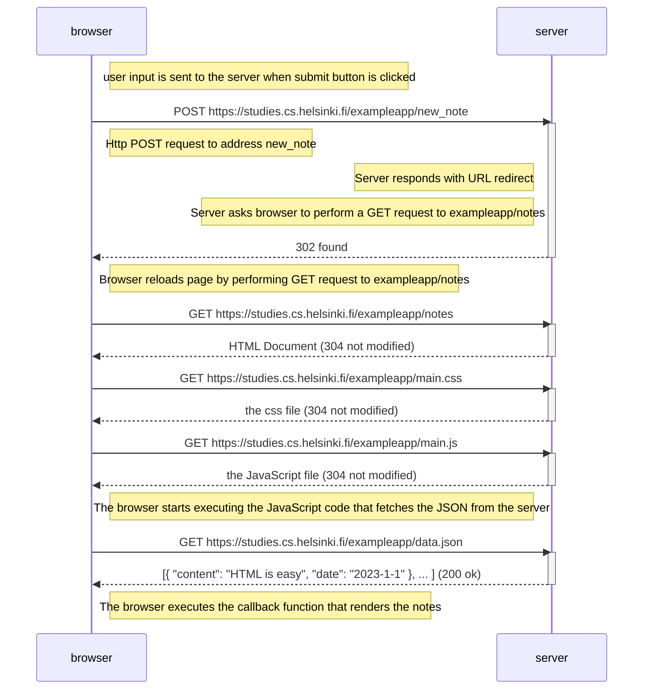

#New Note 

```mermaid
sequenceDiagram
    participant browser
    participant server

    Note right of browser:  user input is sent to the server when submit button is clicked

    browser->>server: POST https://studies.cs.helsinki.fi/exampleapp/new_note 
    activate server

    Note right of browser: Http POST request to address new_note  
    
    Note left of server: Server responds with URL redirect
    Note left of server: Server asks browser to perform a GET request to exampleapp/notes

    server-->>browser: 302 found

    deactivate server

    Note right of browser: Browser reloads page by performing GET request to exampleapp/notes
    browser->>server: GET https://studies.cs.helsinki.fi/exampleapp/notes
    activate server
    server-->>browser: HTML Document (304 not modified)
    deactivate server

    browser->>server: GET https://studies.cs.helsinki.fi/exampleapp/main.css 
    activate server
    server-->>browser: the css file (304 not modified)
    deactivate server

    browser->>server: GET https://studies.cs.helsinki.fi/exampleapp/main.js 
    activate server
    server-->>browser: the JavaScript file (304 not modified)
    deactivate server

    Note right of browser: The browser starts executing the JavaScript code that fetches the JSON from the server

    browser->>server: GET https://studies.cs.helsinki.fi/exampleapp/data.json 
    activate server
    server-->>browser: [{ "content": "HTML is easy", "date": "2023-1-1" }, ... ] (200 ok)
    deactivate server

    Note right of browser: The browser executes the callback function that renders the notes
```

