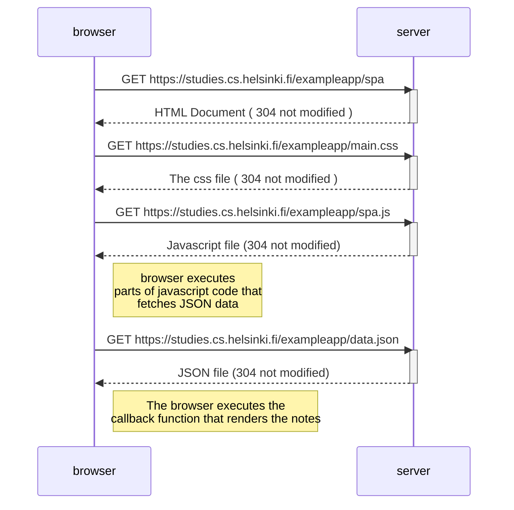

# Single Page Application 

```mermaid
sequenceDiagram
    participant browser
    participant server


    browser->>server: GET https://studies.cs.helsinki.fi/exampleapp/spa
    activate server

    

    server-->>browser: HTML Document ( 304 not modified )
    deactivate server
    browser->>server: GET https://studies.cs.helsinki.fi/exampleapp/main.css
    activate server

     server-->>browser: The css file ( 304 not modified )
    deactivate server

    browser->>server : GET https://studies.cs.helsinki.fi/exampleapp/spa.js
    activate server
    server-->>browser : Javascript file (304 not modified)
    deactivate server 

    Note right of browser: browser executes  <br/> parts of javascript code that <br/> fetches JSON data

    browser->>server: GET https://studies.cs.helsinki.fi/exampleapp/data.json
    activate server
    server-->>browser : JSON file (304 not modified)
    deactivate server
      Note right of browser: The browser executes the <br/> callback function that renders the notes
```
